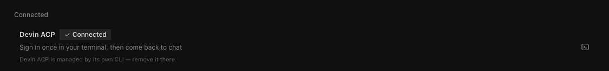
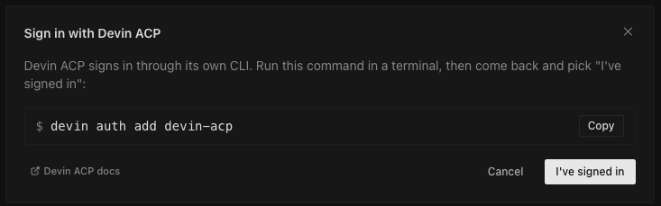

# hermes-devin-acp

A [Hermes Agent](https://hermes-agent.nousresearch.com) model provider plugin that exposes your [Devin](https://devin.ai) subscription models through Hermes, using your authenticated Devin CLI. A Devin subscription is required.

## Prerequisites

1. **Devin CLI** installed and authenticated:
   ```bash
   devin auth login
   ```

2. **Hermes Agent** v0.20.0+ (with model provider plugin support)

## Install

#### Desktop / Dashboard

Open **Settings → Plugins**, click **Install from Git**, and paste `paxytools/hermes-devin-acp` or the full Git URL:

```
https://github.com/paxytools/hermes-devin-acp.git
```

#### — or —

#### CLI

```bash
hermes plugins install paxytools/hermes-devin-acp
hermes plugins enable devin-acp
```

## Configure

1. Go to **Settings → Providers** and select **Devin ACP**:

   

2. Run `devin auth login` in your terminal, then click **I've signed in**:

   

3. Select your model and click **Begin**:

   

You're all set.

## Uninstall

```bash
hermes plugins remove devin-acp
```
